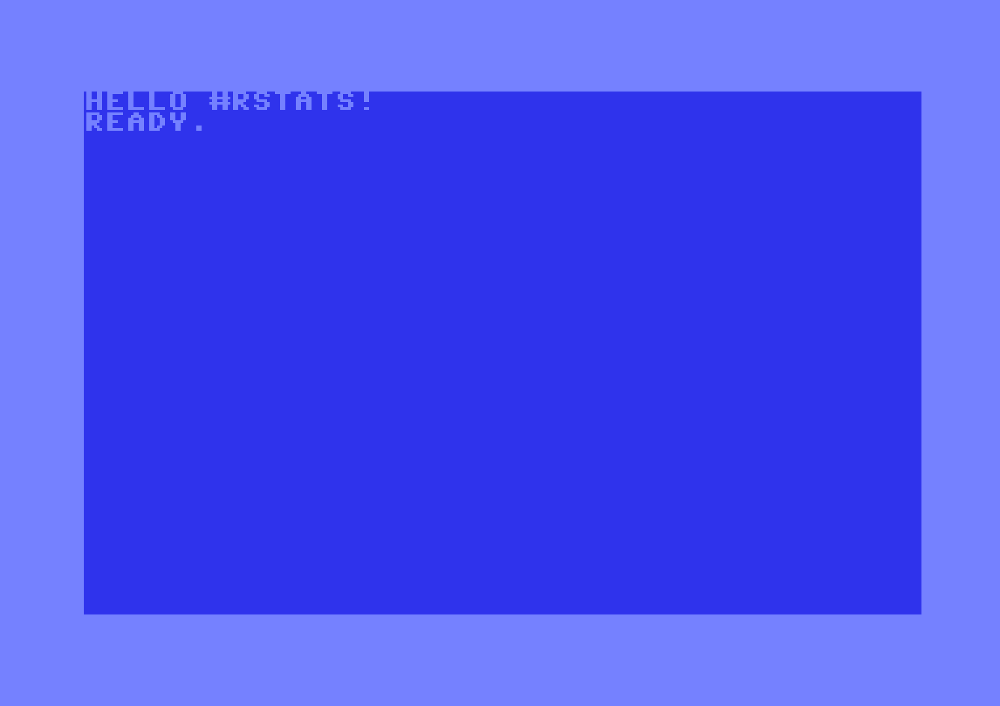
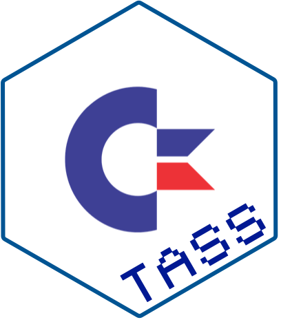

# c64tass 

<!-- badges: start -->


<!-- badges: end -->

`{c64tass}` is a wrapper around
[TASS](https://sourceforge.net/projects/tass64/) - a standard 6502
assembler used for developing for the c64.

Note: `TASS` and this package represent a **compiler** i.e. a way of
turning c64 assembly into 6502 machine code. It **does not** execute the
code or provide a c64 emulator for doing so.

For interfacing with a running VICE instance on a local machine see
[`{c64vice}`](https://github.com/coolbutuseless/c64vice)

## What’s in the box

- The `TASS` R6 class with the following methods:
  - `initialize(asm)` with assembly text or file reference
  - `compile()` compile the assembly code using TASS
  - `get_prg()` get the compiled `prg` file as a raw vector

## Installation

You will need to have TASS already installed on your machine to make use
of this package.

On macOS using homebrew: `brew install tass64`

``` r
remotes::install_github('coolbutuseless/c64tass')
```

## A simple 6502 program

The following c64/6502 ASM code will clear the screen and then write
`Hello #rstats!` at the top

``` r
asm <- '
*=$0801
  .byte $0c, $08, $0a, $00, $9e, $20  ; 10 SYS 2080
  .byte $32, $30, $38, $30, $00, $00
  .byte $00

*=$0820
      lda #$93        ; Clear the screen
      jsr $ffd2

      ldx #$00        ; initialise the offset pointer into our message
loop  lda message,x   ; load a character and write it to screen 
      and #$3f        ; Manually place chars on screen
      sta $0400,x
      inx
      cpx #$0e
      bne loop

      rts

message
    .text "Hello #rstats!"
'
```

## Compile the ASM to 6502 machine code.

``` r
library(c64tass)

tass <- TASS$new(asm = asm, tass_bin = "/opt/homebrew/bin/64tass")
tass$compile()
prg <- tass$get_prg()
prg
```

    ##  [1] 01 08 0c 08 0a 00 9e 20 32 30 38 30 00 00 00 00 00 00 00 00 00 00 00 00 00
    ## [26] 00 00 00 00 00 00 00 00 a9 93 20 d2 ff a2 00 bd 35 08 29 3f 9d 00 04 e8 e0
    ## [51] 0e d0 f3 60 c8 45 4c 4c 4f 20 23 52 53 54 41 54 53 21

## Run c64 programs using VICE

There are a number of ways to run the compiled program:

- Save to physical media somehow and load on a real c64
- Save the `prg` data as raw bytes to a file and then load in `VICE` or
  any c64 emulator.
- Pipe the bytes directly into the memory of a running `VICE` emulator

The code below shows the third option i.e. write the prg into memory

``` r
library(c64vice)

# VICE must already be running with the binary monitor activated.
# .e.g.   `x64sc -binarymonitor`
c64vice::run_prg(prg)
```



## c64-verse

<a href="https://github.com/coolbutuseless/c64tass">
 </a>

<a href="https://github.com/coolbutuseless/c64asm">
 </a>

<a href="https://github.com/coolbutuseless/c64vice">
 </a>

## Acknowledgements

- R Core for developing and maintaining the language.
- CRAN maintainers, for patiently shepherding packages onto CRAN and
  maintaining the repository
